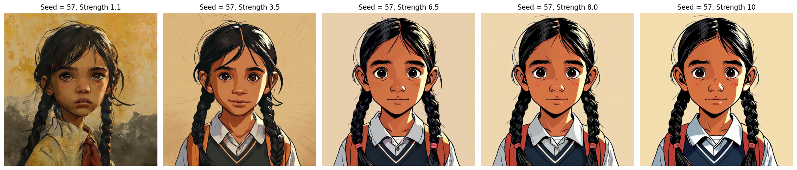
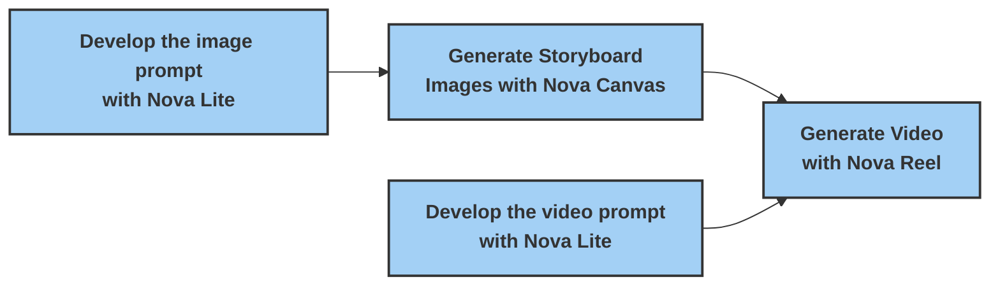

# Character Consistent Storyboarding with Amazon Nova - Part 1

This directory contains code and resources for the first part of our blog series on building character-consistent storyboards using Amazon Nova on Amazon Bedrock.

## Introduction

The art of storyboarding has long been the backbone of content production, serving as a critical visualization tool across filmmaking, animation, advertising, and UX design. As creators craft sequential illustrations to map out their narratives, generative AI serves as a powerful assistant. Foundation models like Amazon Nova Canvas and Amazon Nova Reel offer capabilities in transforming text and image inputs into professional-grade images, as well as short clips poised to revolutionize the pre-production process.

While these models can generate concepts en masse, which is great for creative exploration, achieving consistent character designs and maintaining stylistic coherence across scenes remains a challenge. Even minor adjustments to prompts or configurations can result in dramatically different visual outputs, making it difficult to maintain narrative continuity.

In this first part, we dive into prompt engineering and character development pipelines, demonstrating how to establish reliable prompt patterns that yield consistent results using Amazon Nova Canvas and Reel models.

## Contents

- `01-character-design.ipynb`: Notebook for creating consistent character designs
- `02-storyboard-generation.ipynb`: Notebook for generating complete storyboards with consistent characters
- `helpers/`: Directory containing utility functions and helper scripts:
  - `bedrock_helpers.py`: Functions for interacting with Amazon Bedrock
  - `display_helpers.py`: Functions for visualizing storyboards and results
  - `prompt_helpers.py`: Templates and functions for creating effective prompts
  - `image_utils.py`: Utilities for image processing and display
- `output/`: Directory for storing generated images and videos
- `requirements.txt`: Python dependencies required for the project

## Prerequisites

- AWS account with access to Amazon Bedrock
- Appropriate IAM permissions for Bedrock, S3, and related services
- Python 3.x environment

## Installation

1. Install the required dependencies:
   ```
   pip install -r requirements.txt
   ```

2. Configure your AWS credentials with appropriate permissions for Amazon Bedrock.

## Workshop Structure

### Part 1: Character Design (01-character-design.ipynb)

This notebook focuses on creating consistent character designs using Amazon Nova Canvas:

1. **Text-to-Image Generation**: Learn how to use text prompts to generate character images
2. **Visual Style Control**: Apply different visual styles to character designs
3. **Character Variations**: Use seed values to create consistent character variations
4. **Parameter Tuning**: Explore how the `cfgScale` parameter affects image generation
5. **Scene Consistency**: Place the character in different scenes while maintaining visual consistency



### Part 2: Storyboard Generation (02-storyboard-generation.ipynb)

This notebook demonstrates a complete storyboarding workflow:

1. **Story Generation**: Use Claude 3 Sonnet to create structured story scenes from a simple concept
2. **Image Prompt Generation**: Create optimized prompts for each storyboard panel
3. **Storyboard Panel Generation**: Generate consistent panels using Nova Canvas
4. **Video Generation**: Bring storyboard panels to life with Nova Reel

## Storyboard Generation Pipeline

The following diagram illustrates the core functional steps in the storyboard generation process:



## IAM Permissions Requirements

To run these notebooks successfully, your IAM role needs the following permissions:
- `bedrock:InvokeModel` - For calling the Bedrock models
- `bedrock:GetAsyncInvoke` - For handling asynchronous model invocations

You can use the following policy to grant these permissions:

```json
{
    "Version": "2012-10-17",
    "Statement": [
        {
            "Sid": "VisualEditor0",
            "Effect": "Allow",
            "Action": [
                "bedrock:InvokeModel",
                "bedrock:GetAsyncInvoke"
            ],
            "Resource": "*"
        }
    ]
}
```

## Next Steps

After exploring the prompt engineering approach in this part, check out Part 2 in the `02-character-consistent-fine-tuning-with-amazon-nova-canvas` directory to learn about fine-tuning Amazon Nova Canvas for even greater character consistency.

## Security

See [CONTRIBUTING](../CONTRIBUTING.md#security-issue-notifications) for more information.

## License

This library is licensed under the MIT-0 License. See the LICENSE file.